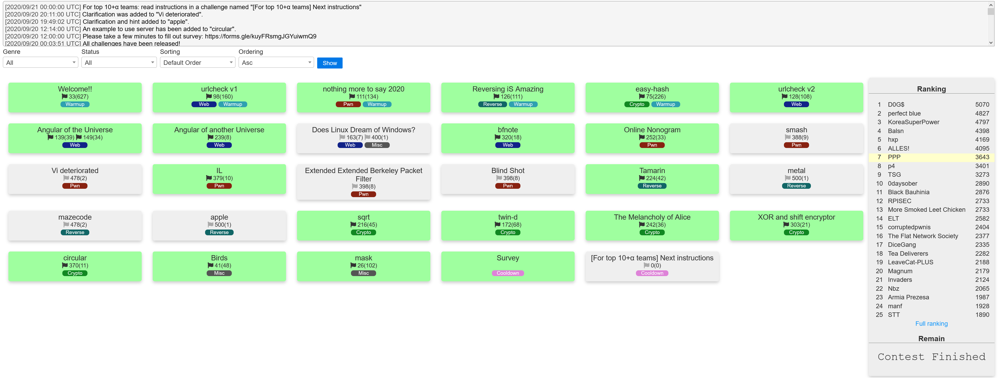

# [TokyoWesterns CTF 2020](https://ctf.westerns.tokyo/)

This was my first time participating in the TokyoWesterns CTF. I spent most of my time on three challenges: `urlcheck v1`, `Tamarin`, and `Does Linux Dream of Windows?`. `urlcheck v1` was solved by someone else, I solved `Tamarin`, and I ran out of time on `Does Linux Dream of Windows?`.

## Write-Ups

### Reverse
* [Tamarin](/tamarin)

## Scoreboard

