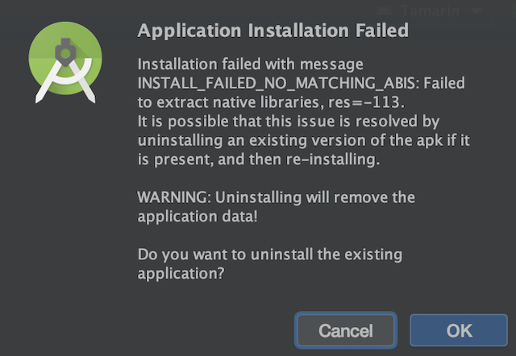
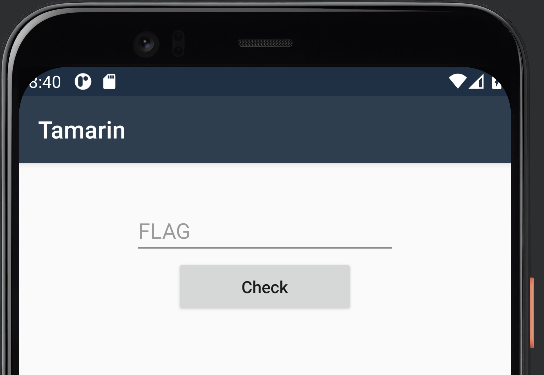

# Tamarin

## Problem

[Tamarin.7z](./Tamarin.7z)

## Files

* [Tamarin.7z](./Tamarin.7z) - Provided 7z file
  - [Tamarin.apk](./Tamarin.apk) - Challenge APK

## Solution

### Emulation

`7z x Tamarin.7z` extracts the only provided file: `Tamarin.apk`. Usually importing an APK into Android Studio and running it in an emulator is trivial, but in this case it was not. Attempting to run it resulted in this error:



Stack Overflow question https://stackoverflow.com/q/24572052 addresses this. We need to create a new emulator with the ABI `armeabi-v7a`. Unfortunately, using this ABI on an x86 host is incredibly slow. I couldn't get the emulator to boot in a reasonable amount of time and the app was not usable. 

After doing some digging, I found this post: https://android-developers.googleblog.com/2020/03/run-arm-apps-on-android-emulator.html

> The new Android 11 system images are capable of translating ARM instructions to x86 without impacting the entire system. This allows the execution of ARM binaries for testing without the performance overhead of full ARM emulation.

So I downloaded the Android 11 developer preview, made a new emulator with an updated SDK and system image, and imported the APK:



Submitting text changes the text to `Invalid`, suggesting that the goal of this challenge is to reverse engineer whatever validation function is checking input to recover the flag.

## Decompilation

Now that the app's behavior is known, the validation function needs to be analyzed. The `java` folder that Android Studio doesn't contain anything interesting besidess `mono` and `xamarin.android` directories. Xamarin and Mono are both .NET technologies, so the source of the program likely is not written in Java. The `cpp` directory is much more interesting. It contains many `.dll.so` files, one is named `libaot-Tamarin.dll.so`:

```
$ file libaot-Tamarin.dll.so
libaot-Tamarin.dll.so: ELF 32-bit LSB shared object, ARM, EABI5 version 1 (SYSV), dynamically linked, stripped
```

I was hopeful at this point and loaded it into Ghidra for analysis. After playing with it and trying the *ARM Aggressive Instruction Finder*, I still couldn't make sense of the disassembly/decompilation. However, it did seem like the validation function was in this file. 

The next thing I tried was the Android Studio debugger. Tracing the Java/CPP calls worked while entering text, but whenever I would submit text to the app it would crash. 

Eventually, I came across this post https://stackoverflow.com/questions/44097544/decompile-apk-built-with-xamarin/51760141 that suggested https://github.com/tjg1/mono_unbundle. 

```
apktool d Tamarin.apk
mono_unbundle Tamarin/lib/armeabi-v7a/libmonodroid_bundle_app.so dlls/
```

Now that the original DLLs have been extracted, they can be decompiled with a tool like https://github.com/icsharpcode/ILSpy. This tool perfectly decompiled `Tamarin.dll`!


## Understanding The Source

The source has been recovered. At this point it should be straightforward to figure out what's going on.

1. The input text is passed to `Func4()` to be validated.
```
if (Check.Func4(((TextView)flagText).get_Text()))
{
  ((TextView)flagText).set_Text("The flag is TWCTF{" + ((TextView)flagText).get_Text() + "}");
}
```

2. `Func4()` verifies that the length of the input string is 88
```
// equations_arr.GetLength(0) is 22, 22 * 4 == 88
if (array.Length != equations_arr.GetLength(0) * 4)
{
  return false;
}
```

Success! Solution was to decompile with `apktool` then `mono_unbundle` then reverse the C#

Turns out to be some normalizing of numbers. Since we know what the final number should be,
we can reverse it:

Function(coefficients, x, pos) = (coefficients[pos] * x^pos) + (coefficients[pos-1] * x^pos-1) + ...

We know what the result should be, so the flag integer is:

final_result - Function(coeffiecents, x, pos).

Requires that function() exit when pos is 0 instead of -1.

Woo!


Flag: `TWCTF{Xm4r1n_15_4bl3_70_6en3r4t3_N471v3_C0d3_w17h_VS_3n73rpr153_bu7_17_c0n741n5_D07_N3t_B1n4ry}`


